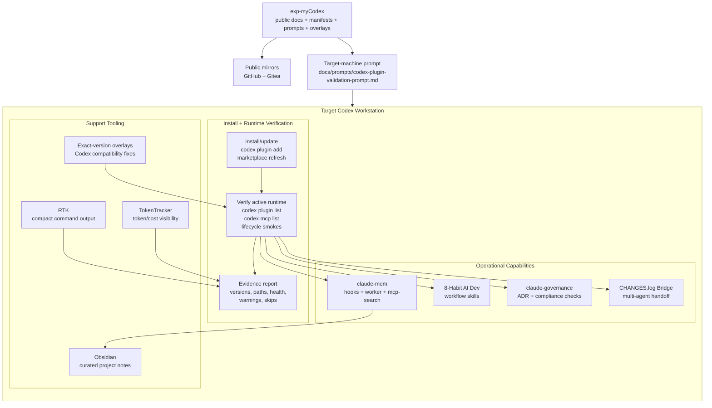

# exp-myCodex

> A public, evidence-first Codex workstation playbook: memory, plugins,
> governance, token visibility, and runtime validation from real setup work.

[](#what-this-repo-is)
[](#evidence-model)
[](#toolchain)
[](LICENSE)

`exp-myCodex` is a professional handoff kit for preparing Codex on another
machine. It packages the useful parts of one real workstation setup into public
runbooks, manifests, overlays, and prompts that another Codex session can read
and execute safely.

It is built around one principle: **do not call a Codex setup healthy until the
active runtime proves it**.

## What This Repo Is

This repository is not a marketing demo, a private incident log, or a one-shot
installer. It is a public-safe operating kit for Codex users who want:

- memory through `claude-mem` and `mcp-search`
- curated second-brain notes through Obsidian
- workflow discipline through `8-habit-ai-dev`
- governance and ADR support through `claude-governance`
- token/cost visibility through TokenTracker
- compact command output through RTK
- multi-agent handoff through the CHANGES.log Bridge Pattern
- bounded worker coordination through a local Meta-Loop Control ledger
- exact-version overlays when fast-moving plugins break Codex behavior
- repeatable validation prompts for target machines

Private infrastructure details, secrets, customer context, raw transcripts, and
machine-specific incident records are intentionally excluded.

## Start Here

For a new workstation, give Codex this repo and then run the validation prompt:

```text
Read https://github.com/pitimon/exp-myCodex

Then follow docs/prompts/codex-plugin-validation-prompt.md.
```

That prompt is intentionally short. The validation prompt itself now tells the
target Codex session to read the live `claude-mem` errata threads before it
declares a new machine healthy:

```text
https://github.com/pitimon/exp-myCodex/issues/5
https://github.com/pitimon/exp-myCodex/issues/6
https://github.com/pitimon/exp-myCodex/issues/8
```

This keeps the first prompt stable while the operational details continue to
change across Codex, `claude-mem`, Node, shell, and marketplace updates.

Expected outcome on a target workstation is not "the latest plugin installed."
Expected outcome is a concise bootstrap report that proves the active runtime:

- plugin and marketplace state were read from the target machine
- `claude-mem` worker health was matched to the current user
- Codex plugin path, versioned cache, staging roots, and user-level hooks were
  inspected separately
- any exact-version overlay or issue-documented workaround was applied only
  after the active version was identified
- CHANGES.log Bridge setup was verified when Claude Code and Codex may share a
  repository
- a real `codex exec` lifecycle smoke completed startup, prompt, tool, and stop
  hooks with no `Failed` entries

For a human reading the repo, use this path:

| Step | Read                                             | Outcome                                            |
| ---- | ------------------------------------------------ | -------------------------------------------------- |
| 1    | `docs/README.md`                                 | Understand the documentation map                   |
| 2    | `docs/prompts/codex-plugin-validation-prompt.md` | Get the target-machine validation prompt           |
| 3    | issues `#5`, `#6`, and `#8`                      | Read the live `claude-mem` hook and upgrade errata |
| 4    | `docs/manifests/codex-plugins.yaml`              | See recommended plugin selectors and versions      |
| 5    | `docs/manifests/codex-tools.yaml`                | See adjacent CLI tools and smoke tests             |
| 6    | `docs/runbooks/tools/changes-log-bridge.md`      | Prepare multi-agent local handoff                  |
| 7    | `docs/runbooks/plugins/claude-mem.md`            | Validate the memory layer                          |
| 8    | `docs/runbooks/claude-mem-scenario-tests.md`     | Stress-test the runbook on a real machine          |
| 9    | `docs/prompts/meta-loop-validation-prompt.md`    | Validate the workflow-only control ledger safely   |

## System View



## Evidence Model

This repo avoids the common failure mode where documentation says “installed”
but the active Codex runtime is still stale, disabled, or pointed at a different
cache.

Every runbook pushes the operator toward observable evidence:

| Layer               | Do Not Trust Alone                        | Verify Instead                                                  |
| ------------------- | ----------------------------------------- | --------------------------------------------------------------- |
| Codex plugins       | repo files, release tags, old screenshots | `codex plugin list`, active plugin path, installed version      |
| MCP                 | plugin manifest only                      | `codex mcp list`, tool availability, smoke queries              |
| `claude-mem` worker | one healthy HTTP response                 | port, `workerPath`, process owner, `worker.pid`, settings       |
| `claude-mem` hooks  | startup banner text                       | hook JSON shape, `SessionStart` payload probe, warm-up behavior |
| Obsidian notes      | raw capture files, transcript dumps       | curated project note, source IDs, index link, no secrets        |
| Overlays            | newest directory by timestamp             | exact active plugin version and matching overlay directory      |
| TokenTracker/RTK    | package install success                   | version output, service status, smoke tests                     |
| CHANGES.log Bridge  | copied prose or assumed global ignore     | protocol parity, top-level fallback, `git check-ignore -v`      |

## Toolchain

| Area          | Component             | Why It Is Here                                                            | Runbook                                      |
| ------------- | --------------------- | ------------------------------------------------------------------------- | -------------------------------------------- |
| Memory        | `claude-mem`          | Reuse historical agent memory through Codex hooks and `mcp-search`        | `docs/runbooks/plugins/claude-mem.md`        |
| Second brain  | Obsidian              | Store curated human-readable project notes without replacing `claude-mem` | `docs/runbooks/tools/obsidian.md`            |
| Workflow      | `8-habit-ai-dev`      | Keep AI-assisted engineering structured and reviewable                    | `docs/runbooks/plugins/8-habit-ai-dev.md`    |
| Governance    | `claude-governance`   | Add ADR, compliance, and engineering governance support                   | `docs/runbooks/plugins/claude-governance.md` |
| Visibility    | TokenTracker          | Track token/cost usage and run a local dashboard/service                  | `docs/runbooks/tools/tokentracker.md`        |
| Efficiency    | RTK                   | Reduce noisy command output before it reaches Codex context               | `docs/runbooks/tools/rtk.md`                 |
| Handoff       | CHANGES.log Bridge    | Coordinate Claude Code and Codex through a local git-ignored scratchpad   | `docs/runbooks/tools/changes-log-bridge.md`  |
| Coordination  | Meta-Loop Control     | Record task lifecycle and attestations; never launch workers              | `docs/runbooks/tools/meta-loop.md`           |
| Compatibility | `claude-mem` overlays | Patch known Codex compatibility breaks by exact plugin version            | `overlays/`                                  |

## The CHANGES.log Bridge Pattern

The Bridge Pattern prepares a target workstation for projects where Claude Code
and Codex may work in the same git repository. It is intentionally a userspace
setup, not a repo-local config change.

The runbook verifies:

- the same Bridge Protocol exists in `~/.claude/CLAUDE.md` and
  `~/.codex/AGENTS.md`
- `project_doc_fallback_filenames = ["CLAUDE.md"]` is a top-level Codex config
  key, so Codex can read project `CLAUDE.md` files when no `AGENTS.md` exists
- `CHANGES.log` is ignored through the configured global git excludesfile
- the latest handoff entry matches recent file changes and is not staged for PRs
- `core.hooksPath` is noted when repo-tracked git hooks need separate handling

Use `docs/runbooks/tools/changes-log-bridge.md` for the full implementation and
verification steps. The repo documents the pattern for other machines; it should
not mutate this workstation's global `~/.claude`, `~/.codex`, or git config
unless the operator explicitly requests that.

## The `claude-mem` Pattern

The most important memory lesson from this setup is to validate Claude Code
first, then attach Codex to the already-working memory worker.

The runbook checks:

- Claude Code-first `claude-mem` preflight
- Codex plugin install/update state
- health on ports `37701` and `37777`
- foreign worker detection on shared hosts
- `mcp-search` availability
- unsupported `suppressOutput` hook regressions
- exact-version overlay handling for `13.4.0`, `13.4.1`, `13.4.2`, `13.6.2`, and `13.8.0`
- scenario tests for read-only and state-changing validation

When `claude-mem` releases a new version, this repo intentionally treats that as
a new runtime contract. Do not apply an old overlay to a new cache just because
the file names look familiar.

Issues #5, #6, and #8 are the living records for this failure class:

```text
https://github.com/pitimon/exp-myCodex/issues/5
https://github.com/pitimon/exp-myCodex/issues/6
https://github.com/pitimon/exp-myCodex/issues/8
```

Use them for newly observed hook failures, schema/parser drift, and
version-specific upgrade workarounds. Keep the repo runbooks as the stable
baseline, and add concise issue comments when a target machine reveals a new
Codex or `claude-mem` runtime edge case.

The current verified Codex baseline is `claude-mem` `13.8.0` with the local
overlay under `overlays/claude-mem/13.8.0/`. The older 13.6.2 overlay remains
available for exact-version legacy workstations. Both overlays record the same
core rule: patch only the matching active version, inspect every live-resolvable
root, and finish with real Codex lifecycle smokes.

## The Obsidian Pattern

Obsidian is useful here as a curated, human-readable second brain. It should not
replace `claude-mem` historical observations, and it should not receive raw
transcripts by default.

The pattern from the source workstation is:

- use `claude-mem` and `mcp-search` for historical agent memory and evidence
- stage raw local captures under `Codex/Inbox/` when a capture hook exists
- promote only durable summaries, decisions, runbooks, and lessons into
  `Claude-Mem/Projects/<project>/`
- keep each project note concise, dated, source-backed, and linked from an
  `Index.md`
- never store secrets, tokens, private keys, customer-sensitive data, or raw
  operational logs in Obsidian

Use `docs/runbooks/tools/obsidian.md` when adding this layer to a new machine or
project.

## Repository Structure

```text
docs/
  README.md
  manifests/
    codex-plugins.yaml
    codex-tools.yaml
    public-mirrors.yaml
    verified-versions.yaml
  prompts/
    codex-plugin-validation-prompt.md
  runbooks/
    claude-mem-scenario-tests.md
    codex-claude-mem-memory-runbook.md
    plugins/
      8-habit-ai-dev.md
      claude-governance.md
      claude-mem.md
      template.md
    tools/
      changes-log-bridge.md
      meta-loop.md
      obsidian.md
      rtk.md
      tokentracker.md
overlays/
  claude-mem/
    13.4.0/
    13.4.1/
    13.4.2/
    13.6.2/
    13.8.0/
scripts/
  claude-mem-codex-compat.cjs
```

## Public Mirrors

The project is published in two public locations:

```text
https://github.com/pitimon/exp-myCodex
https://gitea.ipv9.me/pitimon/exp-myCodex
```

Mirror policy lives in:

```text
docs/manifests/public-mirrors.yaml
```

Keep `main` aligned on both mirrors after public documentation updates.

## Maintenance Standard

Before publishing a change:

1. Verify the behavior on a real machine or label the gap clearly.
2. Update the runbook and the relevant manifest together.
3. Use exact plugin selectors and versions where possible.
4. Add overlays only for exact active plugin versions.
5. Run markdown and whitespace checks.
6. Scan changed public files for secrets and private paths.
7. Push `main` to both public mirrors.

## Public-Safety Boundary

Do not publish:

- API keys, OAuth tokens, bearer tokens, private keys, passwords, or kubeconfigs
- raw transcripts or sensitive local logs
- customer context or private operations details
- private issue links
- machine-specific paths unless they are generic examples

When inspecting local settings, report only safe derived facts such as boolean
secret presence and value length.

## Contributing

Useful contributions improve repeatability:

- clearer install/update steps
- better cross-platform validation
- corrected version manifests after live verification
- new scenario tests from real target machines
- troubleshooting notes backed by observed behavior

Avoid claims that are not backed by runtime evidence.

## License

MIT. See `LICENSE`.
