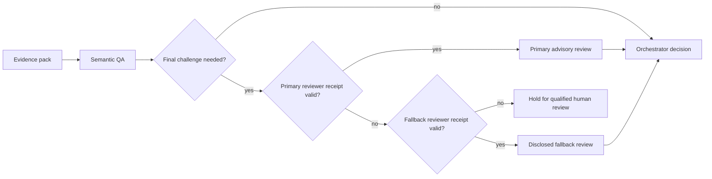

<!-- markdownlint-disable MD013 -->

# Verified Reviewer Routing for Meta Loops

This public pattern adds a bounded final-challenge review to a multi-agent
workflow. It is useful for security-sensitive, high-impact, or irreversible
decisions. It is not needed for a typo, a formatting edit, or a deterministic
check with obvious evidence.

## The problem

A successful command, a requested model label, and a plausible reviewer answer
do not prove that the intended reviewer ran or stayed read-only. A robust loop
therefore needs a small, machine-verifiable receipt before it treats outside
advice as review input.

## Safe routing pattern



The orchestrator remains accountable. A reviewer supplies a challenge or
counterargument; it never executes the change and its response is verified
against the actual evidence pack.

## Receipt contract

Use a wrapper or preflight command that returns one sanitized JSON receipt.
The exact fields and model names are environment-specific, but the checks are
not:

| Check     | Required property                                             | On failure                |
| --------- | ------------------------------------------------------------- | ------------------------- |
| Process   | bounded deadline and successful completion                    | mark unavailable          |
| Identity  | runtime metadata equals the selected reviewer identity        | reject response           |
| Read-only | zero tool calls, or an equivalently verified no-tool boundary | reject response           |
| Content   | non-empty response to a sanitized challenge brief             | reject response           |
| Route     | requested and selected route plus reason                      | disclose fallback or hold |

Example receipt shape:

```json
{
  "requested_route": "primary",
  "selected_route": "fallback",
  "status": "ok",
  "identity_verified": true,
  "tool_use_count": 0,
  "fallback_reason": "primary reviewer unavailable"
}
```

Do not store prompts, complete transcripts, secrets, customer data, or raw tool
output in this receipt.

## Fallback policy

1. Attempt the preferred reviewer once through the verified preflight.
2. If its receipt is absent, late, malformed, mismatched, or non-read-only,
   mark it unavailable; do not retry silently.
3. Attempt the configured fallback reviewer with the same identity and
   read-only checks.
4. If the fallback passes, record that a fallback—not the preferred
   reviewer—performed the challenge.
5. If no qualified route passes, hold irreversible work for a qualified human
   reviewer. A semantic QA review can still identify gaps, but must not be
   presented as independent final challenge signoff.

The fallback may be from the same model family. Treat it as a continuity
mechanism, not proof of independent review.

## Minimal validation

Before using a route on a new workstation or after a runtime/model update:

1. Run unit tests for receipt parsing, wrong-identity rejection, tool-use
   rejection, timeout handling, and fallback selection.
2. Run a harmless primary canary and retain only its sanitized receipt.
3. Force the primary route unavailable and prove that the fallback receipt is
   selected and accurately labelled.
4. Confirm that an invalid primary and invalid fallback result in `hold`.

A reference implementation validated all four outcomes. That result is useful
evidence for its source environment, not a portability guarantee; each target
machine must repeat the canaries with its own runtime metadata.

## Operational checklist

- [ ] Reviewer brief contains no secrets or private operational data.
- [ ] The route is selected before review work is dispatched.
- [ ] The primary and fallback receipts were verified for this runtime.
- [ ] Fallback use and reviewer limitations are stated in the final handoff.
- [ ] The orchestrator checked the advice against source, test, or runtime
      evidence.
- [ ] High-impact work is held if no qualified route is available.

## Public boundary

Publish the contract and test strategy, not local adapter paths, credentials,
model-account configuration, raw advisory text, or private incident context.
This keeps the pattern reusable without exposing the system that first proved
it.
